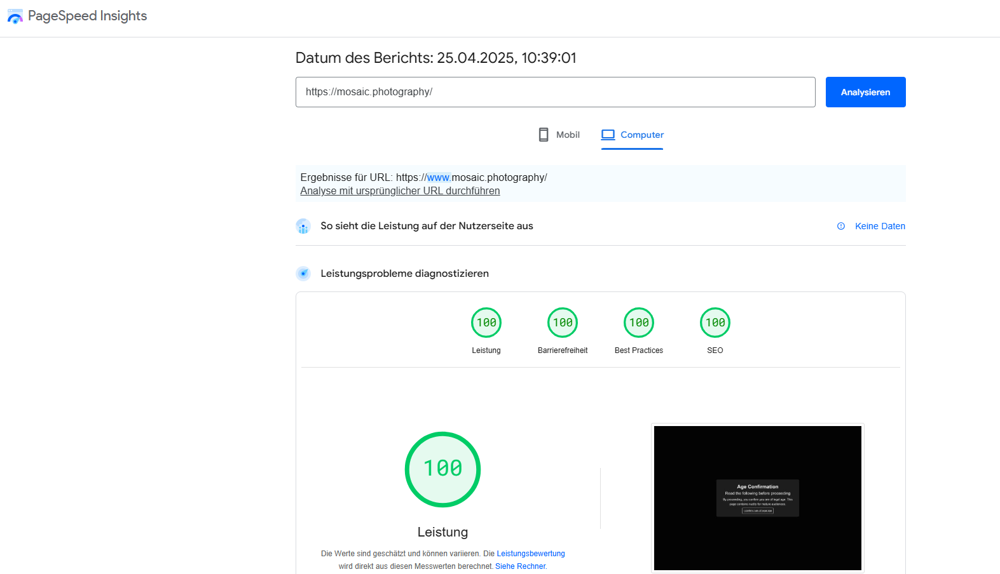
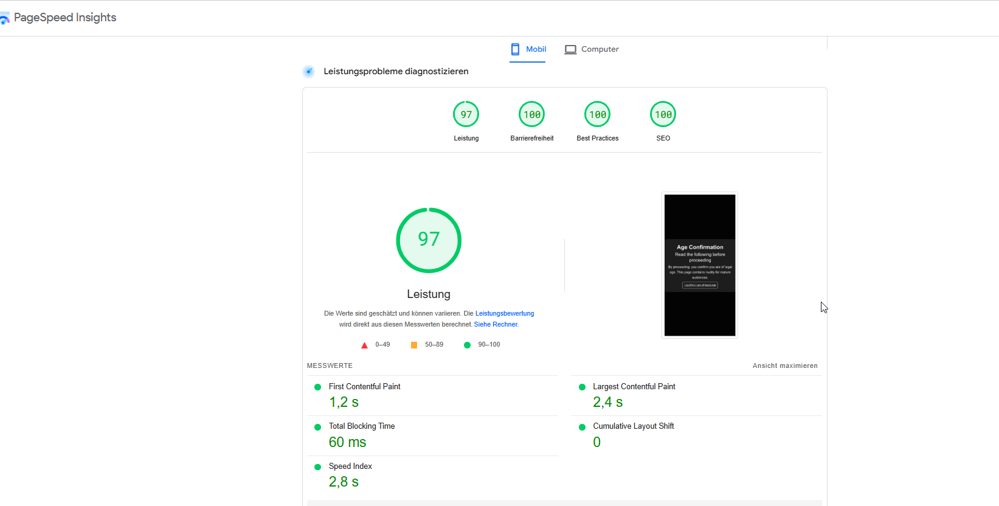

This is a [Next.js](https://nextjs.org) project bootstrapped with [`create-next-app`](https://nextjs.org/docs/app/api-reference/cli/create-next-app).

## Getting Started

First, run the development server:

```bash
npm run dev
# or
yarn dev
# or
pnpm dev
# or
bun dev
```

Open [http://localhost:3000](http://localhost:3000) with your browser to see the result.

You can start editing the page by modifying `app/page.tsx`. The page auto-updates as you edit the file.

This project uses [`next/font`](https://nextjs.org/docs/app/building-your-application/optimizing/fonts) to automatically optimize and load [Geist](https://vercel.com/font), a new font family for Vercel.

## SEO and Ranking Positioning

This project includes precision optimizations for SEO and ranking positioning. Below are some of the measures implemented:

### Meta Tags

- **Dynamic Title and Description**: The application dynamically sets the `<title>` and `<meta name="description">` tags based on the page content, improving relevance for search engines.
- **Keywords**: Relevant keywords are included in the `<meta name="keywords">` tag to enhance discoverability.
- **Viewport Settings**: The `<meta name="viewport">` tag ensures mobile responsiveness, which is critical for SEO.

### Open Graph and Twitter Card Metadata

- **Social Sharing**: Open Graph (`og:title`, `og:description`, `og:image`, etc.) and Twitter Card metadata are included to improve the appearance of shared links on social media platforms.

### Structured Data (JSON-LD)

- **Schema.org Markup**: JSON-LD structured data is implemented to provide search engines with detailed information about the content, such as page type, breadcrumbs, and product details (if applicable).
- **Image SEO Enhancement**: The `JsonLdSchema` component provides structured data specifically optimized for Google Image Search, supporting both single images and image galleries with rich metadata including:
  - Image name and description
  - Credit information
  - Licensing details
  - Technical specifications (dimensions, format)
  - This implementation follows Google's guidelines for image license metadata to improve discoverability and proper attribution in image search results.

### Performance Optimizations

- **No Manual Image Preloading**: All custom image preloading and pre-caching logic has been removed. Images are loaded exclusively using Next.js `<Image />` with `loading="lazy"` as the default, ensuring only visible images are loaded for optimal performance and SEO.
- **Next.js Image Optimization**: The `next/image` component is used to serve optimized images with automatic resizing and format conversion (e.g., WebP). All images include proper `alt`, `width`, and `height` attributes for accessibility and SEO.
- **Code Splitting**: Next.js automatically splits code to reduce initial load time.
- **Caching and Compression**: Image assets are served with caching headers and gzip compression using optimized AWS-S3 CDN.

#### Image Preloading Policy (2025 Update)

> **Note:** As of September 2025, all manual image preloading utilities (`preloadGallery.ts`, `preloadPhotographers.ts`) have been removed from the codebase. This change was made to maximize SEO and performance, prevent unnecessary bandwidth usage, and ensure that only images visible in the viewport are loaded. No traces of old preloading logic remain.

**Key points:**

- No image preloading except for what browser/Next.js does natively.
- All gallery and photographer images are loaded via Next.js `<Image />` with lazy loading.
- No dead code or obsolete preloading utilities remain in the project.

For more details, see code comments in `ImageWrapper` and `ImageCard` components.

### Mobile Responsiveness

- The application is fully responsive, ensuring a seamless experience across devices. This is achieved using CSS media queries and responsive design principles.

### Accessibility

- **Semantic HTML**: Proper use of semantic HTML elements (e.g., `<header>`, `<main>`, `<footer>`) improves accessibility and SEO.
- **ARIA Attributes**: ARIA roles and attributes are used where necessary to enhance screen reader compatibility.

## Functionality and Tools

This project is a gallery of high-resolution images with the following features and tools:

- **Image Hosting**: Images are hosted on **AWS S3** and served through a **Content Delivery Network (CDN)** for fast and reliable delivery.
- **Database**: Image metadata and other content are managed using **Supabase**, a powerful backend-as-a-service platform.
- **Frontend Framework**: Built with **Next.js**, leveraging its server-side rendering (SSR) and static site generation (SSG) capabilities for optimal performance and SEO.
- **Image Loading**: High-resolution images are dynamically loaded and optimized using the `next/image` component, ensuring fast load times and reduced bandwidth usage.

### Image Orientation Script

The project includes a utility script to automatically detect and correct image orientation:

- **Script Location**: Located at `scripts/update-image-orientation.md`
- **Purpose**: Automatically detects and corrects the orientation of images based on their EXIF data
- **Usage**: Follow the instructions in the script file to process new images before they are displayed in the gallery
- **Benefits**: Ensures consistent presentation of images regardless of the camera settings used during capture

This script is particularly useful when uploading new images from various sources, as it standardizes their orientation for proper display in the gallery.

### Image Sitemap Generator

The project includes a script to generate an XML sitemap specifically for images:

- **Script Location**: Located at `scripts/generate-image-sitemap.ts`
- **Purpose**: Creates an XML sitemap that helps search engines discover and index your images more effectively
- **Benefits**: Improves image SEO by providing search engines with additional metadata about your images

**Running the Image Sitemap Generator:**

1. Ensure you have the required environment variables set up (NEXT_PUBLIC_SUPABASE_URL and SUPABASE_SERVICE_ROLE_KEY)
2. Run the script with:

```bash
# Navigate to project root
cd path/to/mosaic-photography

# Compile and run the TypeScript script
npx ts-node scripts/generate-image-sitemap.ts
```

This will generate an `image-sitemap.xml` file in the `public` directory, which will be served at the root of your website. For best results, add this sitemap to your robots.txt file and submit it to Google Search Console.

### Visual Overview

Below are two images showcasing the SEO improvements:


_Figure 1: Google PageSpeed Insights scores for desktop (100, 100, 100, 100)._


_Figure 2: Google PageSpeed Insights scores for mobile (97, 100, 100, 100)._

## Learn More

To learn more about Next.js, take a look at the following resources:

- [Next.js Documentation](https://nextjs.org/docs) - learn about Next.js features and API.
- [Learn Next.js](https://nextjs.org/learn) - an interactive Next.js tutorial.

You can check out [the Next.js GitHub repository](https://github.com/vercel/next.js) - your feedback and contributions are welcome!

## Deploy on Vercel

The easiest way to deploy your Next.js app is to use the [Vercel Platform](https://vercel.com/new?utm_medium=default-template&filter=next.js&utm_source=create-next-app&utm_campaign=create-next-app-readme) from the creators of Next.js.

Check out our [Next.js deployment documentation](https://nextjs.org/docs/app/building-your-application/deploying) for more details.
